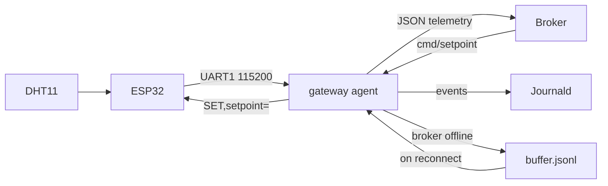

## Fridge gateway

I built an end-to-end gateway system that controls a compressor at a customer site. An ESP32 with a DHT11 collects temperature data every two seconds, runs a two-state machine with a fixed hysteresis band (0.5 °C) and sends it to a Raspberry Pi through a USB-to-UART bridge (115200 baud on UART1l the ESP_IDF log stays on UART0). Each line has a start marker, a sequence number and an XOR checksum. A Python agent parses the data, converts it to JSON and publishes it to an MQTT broker. The system also receives commands from the broker to change the setpoint — the target temperature.

The goal of the project is to manage the electricity demand from HVAC systems. To achieve this, the cloud can change the setpoint remotely and control power consumption with it. When I raise the setpoint, the compressor runs less and the site sheds load. The device confirms the change on its own path: the telemetry payload carries the setpoint and comp fields, so the cloud sees the reported state of the equipment, not just an acknowledgement that the command was delivered.



## Engineering solutions

1. I use text over raw bytes, because each frame (every 2 seconds) is small and I have a huge headroom on serial port capacity (x384). This also makes debugging easier and avoids problems with different endianness.

2. I use three layers to control the correct telemetry transfer through serial port. Marker, to avoid "garbage" on my serial port, due to self-echo or noises. seq field - to see if I miss a frame somewhere. XOR checksum to validate if I receive exactly what I sent. For production, I'd replace XOR with CRC16, because XOR is blind to an even number of bit errors in the same position across bytes. I should use both seq and checksum because seq will miss an error if number is correct, while checksum won't catch a missing frame. 

3. When we get close to setpoint, the compressor would short-cycle, which wears the motor. To make the compressor last longer I use a state machine with hysteresis (0.5 °C).

4. For telemetry I use QoS 0 - because it is not dangerous to lose one frame, as I receive each every 2 seconds. However, for command I use QoS 1 - because the device must receive it. I don't use QoS 2 there because it's unnecessary - it's an idempotent operation.

5. I use retained status topic and LWT, so at every moment a subscriber knows the status of a publisher. At connection to the broker, my agent publishes "online" status and Last Will and Testament is "offline" status. On a clean shutdown, the agent also publishes "offline" as its normal message.

6. I add a buffer to save the data when the broker is offline. The buffer is written to the SD-card, so it won't disappear on reboot or power loss. I flush + fsync on each frame to achieve that. When the buffer exceeds the limit (200 KB), I save the last 500 lines and delete all other lines. I do this using a tmp file and os.replace, to avoid corruption while overwriting a file using open(file, "w"). What is more, if the power is lost between sending the buffer and deleting it, the data will be sent again on restart. The consumer must deduplicate by client_id and sequence number. 

## Limitations

1. I don't use TLS, my traffic is in plaintext and could be caught by anyone.
2. I don't use authentication so anyone can subscribe or publish to any topic.
3. I use checksum to verify data, but I don't use it to verify the command.
4. My sensor uses its own protocol, while in real equipment I would use Modbus RTU over RS-485.
5. I implemented only MQTT, not REST API. I would use it to configuration and provisioning at startup.

## Installation

**Requirements:** Raspberry Pi with Raspberry Pi OS, Python 3.11+, ESP-IDF, ESP32 with a DHT11 on GPIO4, USB-to-UART bridge on UART1 (GPIO17 TX / GPIO16 RX).

**Wiring:** ESP32 GPIO17 → bridge RX, ESP32 GPIO16 → bridge TX, common ground. Do not connect VCC — the boards are powered separately.

1. Flash the firmware:
```
cd firmware
idf.py build flash
```

2. Install the broker:
```
sudo apt update
sudo apt install mosquitto mosquitto-clients
```

3. Create the virtual environment and install dependencies:
```
cd gateway
python3 -m venv venv
source venv/bin/activate
pip install -r requirements.txt
journalctl -u fridge-agent -n 20
```

4. Install the udev rule so the bridge always appears as `/dev/fridge`:
```
sudo cp deploy/99-fridge.rules /etc/udev/rules.d/
sudo udevadm control --reload-rules
sudo udevadm trigger
ls -l /dev/fridge
```

5. Install the systemd unit. Adjust `WorkingDirectory` and `ExecStart` to your path first:
```
sudo cp deploy/fridge-agent.service /etc/systemd/system/
sudo systemctl daemon-reload
sudo systemctl enable --now fridge-agent
```

6. Optional — journal size limit and secrets file:
```
sudo mkdir -p /etc/systemd/journald.conf.d
sudo cp deploy/journald-size.conf /etc/systemd/journald.conf.d/
sudo systemctl restart systemd-journald

sudo cp deploy/fridge-agent.env.example /etc/fridge-agent.env
sudo chmod 600 /etc/fridge-agent.env
```

**Verify:**
```
systemctl status fridge-agent
mosquitto_sub -h localhost -t 'fridge/+/#' -v
```
Telemetry should appear every two seconds, with a retained `online` status.